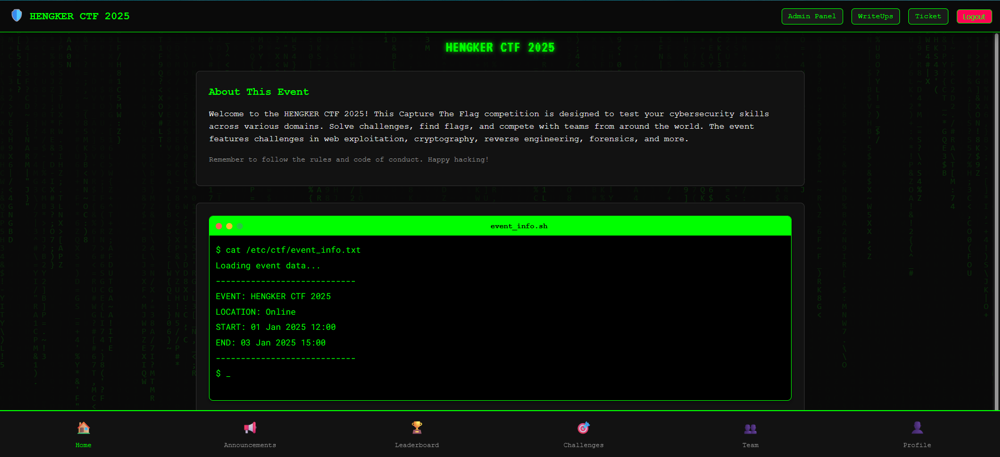

# Hengker CTF Framework


A modern, full-stack platform for hosting Capture The Flag (CTF) competitions. It features a powerful Django REST Framework backend and a React frontend, all served through an Nginx reverse proxy for production readiness. Designed with both security and usability in mind, it provides a complete and scalable solution for running CTF events.

## Why Choose **Hengker CTF Framework**?

Built with Docker for safe and isolated deployment and offers a suite of unique features that set it apart from traditional CTF platforms:

- 🔍 **Challenge Reviews**
  Players can rate and leave reviews on completed challenges, helping others gauge difficulty and quality.

- 🎫 **Ticket System**
  Integrated real-time support ticket system for seamless communication between participants and admins.

- 📝 **Writeup System**
  Built-in platform for sharing and browsing writeups, making knowledge sharing easy and accessible.

## 📋 Prerequisites

Before you begin, ensure you have the following installed:

- [Docker](https://docs.docker.com/get-docker/) (version 20.10 or higher)
- [Docker Compose](https://docs.docker.com/compose/install/) (version 2.0 or higher)
- [Git](https://git-scm.com/downloads)

## 🛠️ Installation

### 1. Clone the Repository

```bash
git clone https://github.com/TanKnight7/CTF_Framework_SE
cd CTF_Framework_SE
```

### 2. Configure the Application

Edit the `config.yml` file to customize your CTF competition:

```yaml
ctf:
  name: "Your CTF Name"
  description: |
    Your CTF Description
    Right here..
  location: "Online"
  start_time: "01-06-2025 12:00" # Format: dd-mm-yyyy hh:mm
  end_time: "03-07-2025 15:00"
  time_zone: "Asia/Jakarta" # start_time and end_time time zone
  convert_to_time_zone: "Asia/Jakarta" # display time zone

credentials:
  admin_username: admin
  admin_email: admin@yourctf.com
  admin_password: your_secure_password
```

### 3. Build and Start the Application

```bash
export CTF_PORT=9999 # Specify the port for the application
bash .script/build_docker.sh
```

### 4. Access the Application

- **Frontend**: http://localhost:9999
- **Backend API**: http://localhost:9999/api
- **Admin Panel**: http://localhost:9999/admin

### Optional: Delete the application (including database)

```bash
bash .script/delete_docker.sh
```

## 📝 API Documentation

The backend provides RESTful API endpoints for all functionality:

- **Authentication**: `/api/auth/`
- **Users**: `/api/users/`
- **Teams**: `/api/teams/`
- **Challenges**: `/api/challenges/`
- **Submissions**: `/api/submissions/`
- **Leaderboard**: `/api/leaderboard/`
- **Tickets**: `/api/tickets/`
- **Writeups**: `/api/writeups/`
- **Announcements**: `/api/announcements/`

---

> **Happy Hacking! 🚀**
